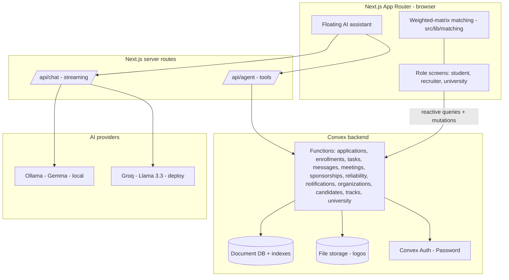

# CapStoned

A talent-cultivation platform where people experience a career before committing to it. Instead of applying to a job and hoping, a candidate joins a milestone-driven mentorship track run by a real company, does real work against AI-scored checkpoints, and builds a verifiable track record. Companies cultivate early talent years before graduation; universities see where their students are heading in aggregate.

CapStoned is explicitly not a job board or an ATS. The unit of value is a mentorship, not a vacancy.

Built for the Talentbank Tech Hackathon 2026 (reference build: "Career OS").

---

## The problem

Career decisions are made with almost no real information. A student picks a path from a course catalogue and a job title; an employer hires from a CV and a one-hour interview. Both sides commit before they have any evidence the fit is real. The result is high dropout, mis-hiring, and a first job that often has little to do with the degree behind it.

The gap is experience. There is no low-risk way to actually try a career, be assessed on real output, and let both sides learn whether it fits before either commits.

## The solution

CapStoned turns "try before you commit" into a product for three audiences on one platform.

- A candidate is matched to tracks by a weighted decision matrix, joins one, and works through real deliverables with a company mentor. Every checkpoint is AI-assessed, so progress is evidence, not a self-report.
- A company publishes a track, reviews applicants, interviews, enrolls mentees, comments on their tasks, chats and schedules meetings, and can lock in promising talent early with a micro-bond (a light sponsorship in exchange for a short future commitment).
- A university sees aggregate, privacy-respecting insight into where its students are matching and progressing, with no per-student surveillance.

A candidate holds exactly one active mentorship at a time. This keeps the experience honest: you commit to one track, do the work, then complete or leave it before pursuing another. Reliability is earned from real events (completing a mentorship, interviewing within SLA), not gifted.

## Who it benefits

- Candidates (ages 15 to 65, not only students): a low-risk way to test a career on real work, an archetype and a weighted match to find fit, and a reliability record they own.
- Companies: a pipeline of pre-vetted early talent evaluated on output, tools to mentor and communicate, and micro-bonds to secure talent before the market does.
- Universities: evidence of student outcomes and demand in aggregate, to steer programs, without collecting individual student data.

---

## How it works

### Candidate journey

1. Onboarding builds a profile and a work-style archetype via the 12 Animals quiz (a fast, memorable read).
2. The Marketplace and AI Assessment rank open tracks with a weighted decision matrix across skills, interests, aspirations, working style, and commitment (the in-depth counterpart to the archetype).
3. The candidate applies to a track; the company must interview within a stated SLA.
4. On enrollment, a mentorship starts with seeded tasks drawn from the track's milestones. The candidate submits deliverables, chats with the mentor, schedules meetings, and can review and sign a micro-bond offer.
5. Completing or leaving the mentorship frees the candidate to pursue another.

### Company journey

1. A recruiter claims or creates a company (with a logo), and one company can be represented by several mentors via memberships.
2. The company publishes a track: identity, cadence, deliverables, and weighted AI checkpoints.
3. Applicants are reviewed, interviewed (a two-way propose/confirm negotiation), and enrolled as mentees.
4. For each mentee the company sets standing, advances weeks, logs hours, edits tasks, comments on each task, runs a live chat, schedules meetings, offers micro-bonds, and marks the mentorship complete.

### University journey

A dashboard surfaces aggregate matching and progression signal for the institution's students, framed for program and partnership decisions and deliberately free of named-student data.

### The one-mentorship rule

Applying and enrolling are both gated server-side: a candidate with an active mentorship cannot apply or be enrolled elsewhere. Enrolling in a track auto-declines the candidate's other live applications and notifies those companies. The candidate lands on My Mentorship after login, and the AI Assessment pins their mentorship company to the top while it runs.

---

## Key features

- Weighted-matrix matching plus a 12 Animals archetype for fast and deep fit.
- Full mentorship lifecycle: apply, interview (SLA-backed, propose/confirm), enroll, tasks, submit, review, complete or withdraw.
- Mentor-mentee communication: per-task comments, a live chat thread, and a propose/confirm meeting scheduler, all scoped and authorized to the two parties.
- Micro-bonds: sponsor a mentee for a milestone or period in exchange for a contract or priority-hiring commitment, with a signable contract.
- Event-sourced reliability for both candidates and companies (earned, clamped 0 to 100, shown as "New" until earned).
- A role-scoped floating AI assistant with function-calling tools (for example, apply to a track) that respects who the user is.
- Reactive everything: Convex live queries mean chat, notifications, standings, and rosters update without a refresh.

---

## Tech stack

- Framework: Next.js (App Router) with React and TypeScript (strict).
- Styling: Tailwind CSS v4, with a custom paper-and-ink design system.
- Animation: GSAP (scoped contexts, matchMedia, prefers-reduced-motion aware).
- Backend and data: Convex (document database, reactive queries, mutations, file storage).
- Auth: Convex Auth (Password provider).
- AI: local Gemma via Ollama for development, Groq (Llama 3.3 70B) in deployment, selected by environment; streamed over a server route with function-calling tools.
- Testing: Vitest with Testing Library (44 tests across screens and libraries).

## Architecture



### How the layers fit

- The client renders role-specific screens and runs the weighted match locally against live track and candidate data, so ranking is instant and explainable.
- Convex is the single source of truth. Functions enforce every rule (the one-mentorship gate, interview SLAs, authorization for chat and meetings) so the server, not the UI, is authoritative. Live queries push updates to every open client.
- The AI layer is stateless and provider-agnostic: the same tool contract runs on local Gemma in development and Groq in deployment, chosen by environment.

### Data model (Convex tables)

`users`, `organizations`, `orgMembers`, `tracks`, `candidates`, `applications`, `enrollments`, `tasks`, `sponsorships`, `messages`, `meetings`, `notifications`, `reliabilityEvents`.

Reliability is derived, not stored as a single number: a base plus an append-only log of `reliabilityEvents`, clamped to 0 to 100. An enrollment carries a lifecycle phase (active, completed, withdrawn); only one active enrollment per candidate is allowed.

---

## Local development

Prerequisites: Node.js, a Convex account, and (for local AI) Ollama with a Gemma model pulled.

```bash
npm install
npx convex dev      # starts the Convex backend and watches functions/schema
npm run dev         # starts Next.js on http://localhost:3000
```

Environment (`.env.local`, not committed):

```
NEXT_PUBLIC_CONVEX_URL=...        # from convex dev
OLLAMA_BASE_URL=http://localhost:11434
OLLAMA_MODEL=gemma4:e4b-it-qat
GROQ_API_KEY=...                  # deployment only
GROQ_MODEL=llama-3.3-70b-versatile
```

Run only one `next dev` and one `convex dev` at a time; concurrent dev servers corrupt the `.next` cache.

## Testing and quality

```bash
npm run typecheck   # tsc --noEmit, strict
npm run test        # vitest run
```

## Deployment

- Convex: `npx convex deploy` for a production deployment, and configure Convex Auth for production (`npx @convex-dev/auth --prod`), which sets `JWT_PRIVATE_KEY`, `JWKS`, and `SITE_URL`.
- Web host (for example Vercel): set `NEXT_PUBLIC_CONVEX_URL` (production), `GROQ_API_KEY`, and `GROQ_MODEL`. AI keys live on the web host, not in Convex.
